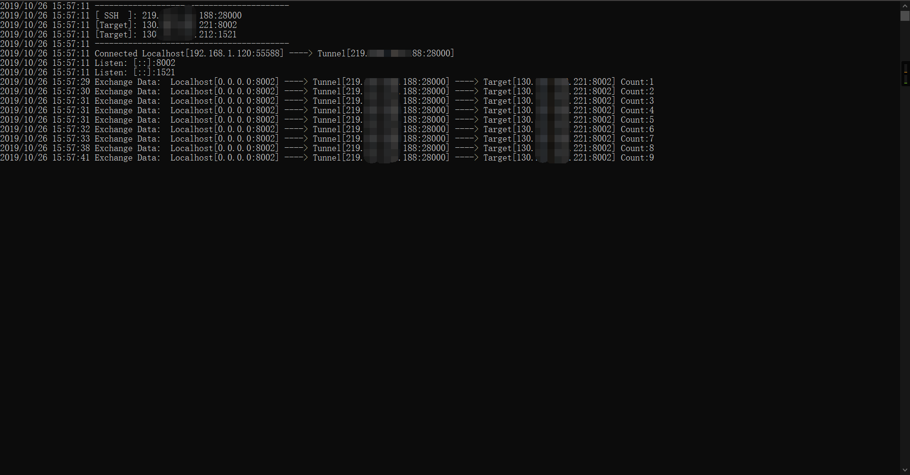

# sshtunnel
ssh本地端口转发工具
```text
{
  // 隧道主机
  "tunnel": {
    "host": "host:port",
    "username": "username",
    "password": "password"
  },
  // 内网主机和绑定的本地端口
  "target": [
    {
      "host": "host:port",
      "bind_port": 本地端口
    },
    {
      "host": "host:port",
      "bind_port": 本地端口
    }
  ]
}
```
